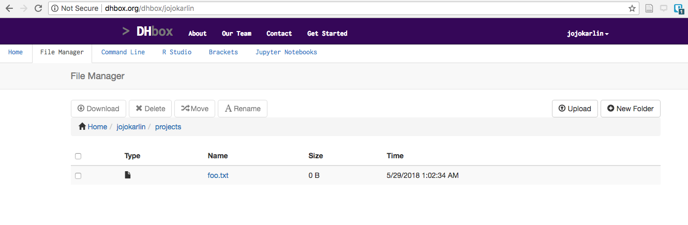

[<<< Previous](navigation.md) | [Next >>>](creating_a_cheat_sheet.md)  

### Creating files and folders

In DH Box, you won't see many folders or files just yet. It's an empty workspace. Let's get ourselves set up for our week.

### Creating a file

So far, we've only performed commands that give us information. Let's use a command that creates something on the computer. 

First, make sure you're in the home directory:

```
$ pwd
/home/jojokarlin
```

Now let's try a new command:

```
touch foo.txt
```

If the command succeeds, you won't see any output. You can now look at the `File Manager` tab of your DH Box, which will look something like a Finder window on Mac OS or Start Menu on Windows. The graphical user interface (GUI), which refers to `File Manager` in this case, pertains to the visual layer applied to any program.



See any differences? If the command was successful and you were in the right place, you should see an empty text file called "foo.txt" in the home directory. 

#### Handy tip: up arrow

Let's say you liked that "foo.txt" file so much you'd like another! In the command line tab, press the "up arrow" on your keyboard. You'll notice this populates the line with the command that you just wrote. You can hit "Enter" to create another "foo.txt," (note - the [`touch`](https://en.wikipedia.org/wiki/Touch_(Unix)) command will not overwrite your document nor will it add another document to the same directory. It will update info about that file.) or you could use your left/right arrows to change the file name to "foot.txt" to create something different. 

As we start to write more complicated and longer commands in our terminal, the "up arrow" is a great shortcut so you don't have to spend lots of time typing. 

### Creating folders

OK, so we're going to be doing a lot of work during the week. Let's create a project folder in our home directory so that we can keep all our work in one place.

Once we return to the `Command Line` tab, make sure we're still in the home folder with `pwd`:

```
$ pwd
/Users/jojokarlin
```

Once you've double-checked where we are, we'll use the command `mkdir`, short for "make directory," to make a folder called "projects":

```
mkdir projects
```

### More Navigation

To see the contents of the directory we are in, rather than checking the `File Manager,` we can run the command `ls` to "list" the contents of our current working directory. In your home directory, type `ls` then `enter` to see if a projects folder has appeared. 

```
$ ls
foo.txt projects
```

Once you confirm that the projects folder was created successfully, you can use the command `cd` into it. 

```
$ cd projects
$ pwd
/home/jojokarlin/projects
```

OK, now you've got a projects folder that you can use throughout the Institute. It should be visible on your graphical desktop, just like the `foo.txt` file we created earlier. 

[<<< Previous](navigation.md) | [Next >>>](creating_a_cheat_sheet.md)

### Example


