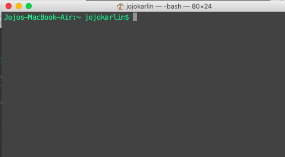

[<<< Previous](why-is-the-command-line-useful.md) | [Next >>>](navigation.md)

## Getting to the command line

### Mac OS

If you're using Mac OS:

1\. Click the Spotlight Search button (the magnifying glass) in the top right of your desktop.  
2\. Type "terminal" into the bar that appears.   
3\. Select the first item that appears in the list.  
4\. The terminal will look like this:  

When you see the `$`, you're in the right place.

*You can change the color of your Terminal or BashShell background and text by selecting `Shell` from the top menu bar, then selecting from the menu under `New Window`.*

Bonus points: if you really want to get the groove of just typing instead of pointing and clicking, you can press "Command (⌘)" and the space bar at the same time to pull up Spotlight search, start typing "Terminal," and then hit "Enter" to open a terminal window. This will pull up a terminal window without touching your mousepad. For super bonus points, try to navigate like this for the next fifteen minutes, or even the rest of this session--it is tricky and sometimes a bit tiring when you start, but you can really pick up speed when you practice!

### Windows

We won't be using Windows's own non-UNIX version of the command line. Follow these steps to install Git Bash, which we will use in this session:

1\. Download [Git for Windows](https://git-for-windows.github.io/) and install it. You'll be asked a bunch of questions but the defaults are fine.
2\. Click the Windows button on the bottom left of your desktop (or hit the Windows button on your keyboard).  
3\. In Programs, open the Git folder.  
4\. Select "Git Bash." (Not "Git GUI.")  
5\. If you can't find the git folder, just type "git bash" in the search box and select "git bash" when it appears.  
6\. You know you're in the right place when you see the `$`.  

In the next section, we'll learn how to navigate the filesystem in the command line.

[<<< Previous](why-is-the-command-line-useful.md) | [Next >>>](navigation.md)
