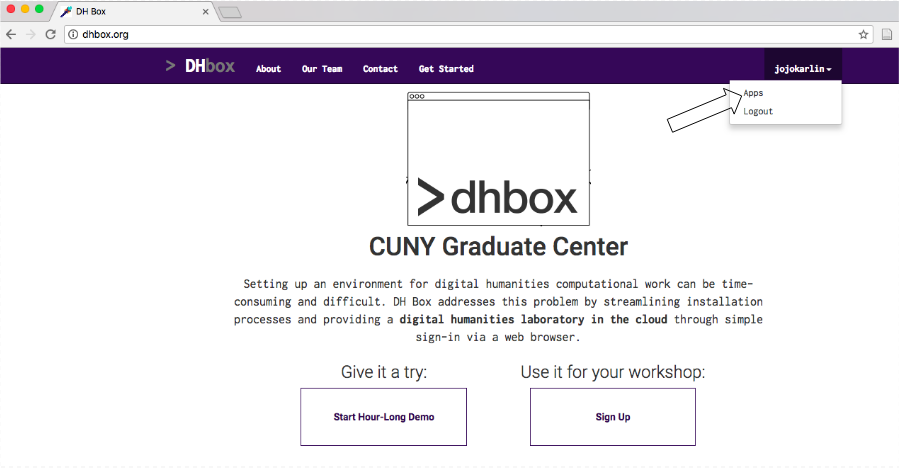
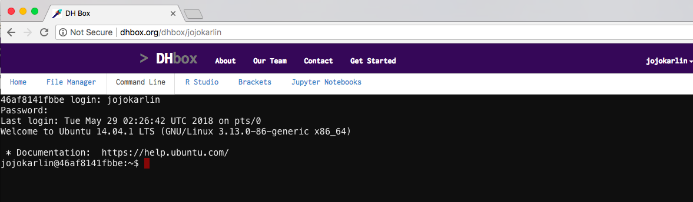

[<<< Previous](why-is-the-command-line-useful.md) | [Next >>>](navigation.md)

## Getting to the command line

We will be using the command line in DH Box. If you log in using the login you created, open the `Command Line` from the apps page. If you find yourself on the DH Box home page once you're logged in, you can access the apps again from the dropdown menu under your user name.

*On your own computer, you can reach the command line to perform these commands locally. Mac OS comes with a Unix shell preinstalled called Terminal. Windows has its own command line interface, but we recommend installing Git Bash, which uses Unix commands.*

### DH Box

Once you're logged in, open the `Command Line` tab in your apps. You'll log in using your DH Box login and password. 

In the next section, we'll learn how to navigate the filesystem in the command line.

[<<< Previous](why-is-the-command-line-useful.md) | [Next >>>](navigation.md)  