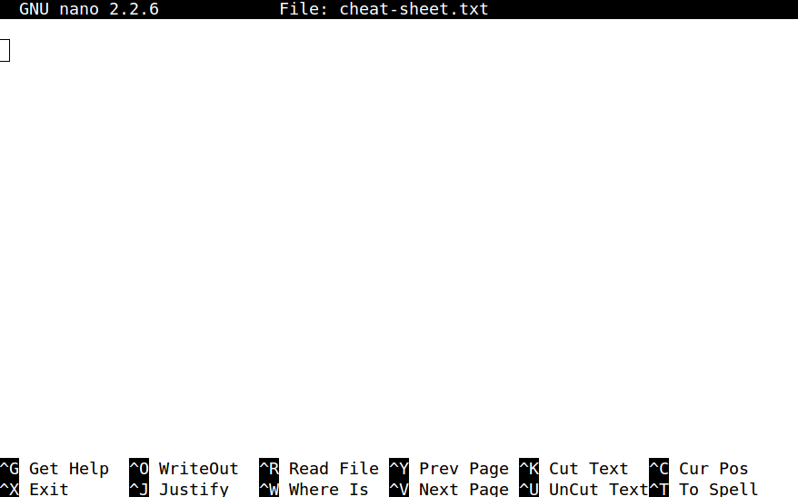

[<<< Previous](grep.md)
[<<< Return to the introduction](README.md)

## More Information about Text Editors

### Editors vs. IDEs

When it comes to editing text and writing code, you can use either a text editor or an IDE (Integrated Development Environment). Text editors tend to be more lightweight solutions, while IDEs try to provide a lot of features to help you write code and tend to target specific languages. There are a lot of exceptions to that description, but the distinction isn't that important. Just know that editors will sometimes describe themselves as IDEs, and that there's a slight difference in philosophy between them.

### Which Text Editor Should I Choose?

#### OSX

- [Textwrangler](http://www.barebones.com/products/textwrangler/) - Simple graphical text editor that is easy to use. If you're used to the Mac way of doing things, TextWrangler should make sense to you. One potential disadvantage is that Textwrangler won't do things like automatically indent Python code.

- [nano](https://www.nano-editor.org/) - GNU nano is a text editor that comes pre-installed in the OSX terminal. nano runs within your terminal window and can be surprising if you aren't aware of its presence. For some operations (say you forget to write a commit message in git), nano will open so that you can insert text. 

If in your terminal you type:

	nano filename.txt

You will open the nano editor in the command line. You'll see your terminal change to look something like this:

When you're done typing to add text to the file, you can save the file by performing these three actions:

1. Hold control and press x.
2. When it asks if you want to save, press <y> for "yes."
2. You'll see the path to the file in the bar. Press <enter> to confirm and your window will resume its command line identity.

### Platform Independent

- [Atom](https://flight-manual.atom.io/getting-started/sections/why-atom/) - Atom is a git and GitHub focused editor. It has advantages if you decide to work a lot with GitHub tools like [GitBooks](https://www.gitbook.com/) and [GitHub Pages](https://pages.github.com/).

#### Fully Customized

- [Emacs](https://www.gnu.org/software/emacs/) - If you are the sort of person who wants full control of your computer's functions, who seeks the power of ORG mode, and who wishes to learn keyboard shortcuts that work across functions, GNU Emacs is the software for you. Emacs requires a fair amount of set-up, but the payoff is that you wind up with the set-up that suits your work habits.

#### Integrated Development Environment [IDE]

As mentioned above, IDEs offer more functions for testing code and running programs. Depending on the amount and type of programming you are doing, an IDE might be overkill. The [IDE Index](http://pypl.github.io/IDE.html) shows relative popularity of editors and IDEs based on search frequency.

- **[IDLE]()https://docs.python.org/2/library/idle.html** - The default Python IDE that comes bundled with every download of Python. Simple to use and good for beginners to Python. Not very polished and lacks advanced features.
- **Spyder** and **PyCharm** - These are Python-specific IDEs. They have more bells and whistles than a standard text editor like Textwrangler, but they're meant specifically for working with Python. Spyder is free and comes bundled with Anaconda. PyCharm is not free, but some people prefer it for working with Python on the web. 
