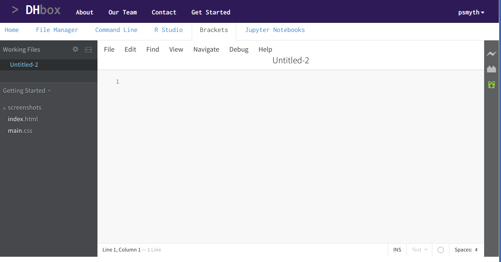

[<<< Previous](variables.md) | [Next >>>](loops.md)

## Running scripts

So far, you've interacted with Python one line at a time in the REPL. For the rest of this session, we're going to write and execute longer programs.

### Your first script

In DH Box, click the "Brackets" tab on the Apps bar, below the purple navigation bar at the top. Once open, Brackets looks something like this:


Click `File` and select `New`. Your editor will look like this:



Type this text on the first line in Brackets:

```python
print("Hello world!")
```
	
Click `File ` on the top right in Brackets and select `Save As...`. You will then want to open the folder that is the username you signed up with for DH Box. Once you're in that folder, type `hello.py` in the text box above the file browser to save the file.

Now let's run our short program, `hello.py`. Click the App tab that says "Command Line." Log in again if you need to using your DH Box username and password. Once at the prompt, type:

```bash
python3 hello.py
```

You should see this output:

	Hello world!
	
Unlike when using the REPL (as before), we need to use the `print()` function to see output from our program when running as a script.

Congratulations! You've written your first script. That's kind of a big deal.

## Challenges

1. Rewrite your program so that you assign the message to a variable, then print the variable. This will make your program two lines instead of one. There's a fancy programmer word for rewriting your code without changing it's behavior—"refactoring."

2. (optional) Are you already getting sick of typing `python hello.py` again and again? Try typing `!!` in the command line (the `$`). This will run your last line of code again.

## A Note on Text

We talked about this in the command line session, but, fundamentally, Python programs are just text files. You can write them in any text editor, like Sublime Text or Notepad on Windows. When you pass the text file to Python, it runs the code in the file one line at a time. There's nothing special about `.py` files, they're just regular text files. This makes them work well with command line tools like Git. The tools you've learned so far—the command line, Git, markdown, grep, Sublime—are all designed to work well together, and the medium through which they all work is plain text.

[<<< Previous](variables.md) | [Next >>>](loops.md)
